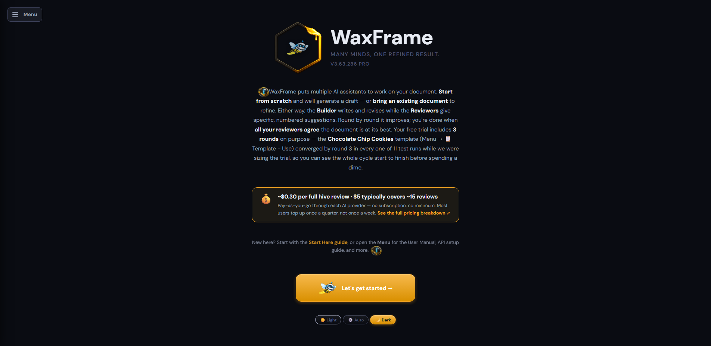
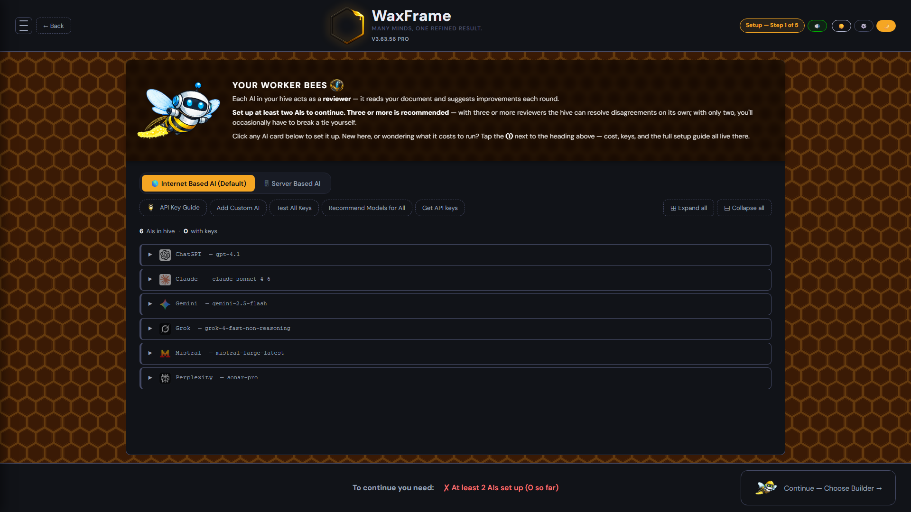
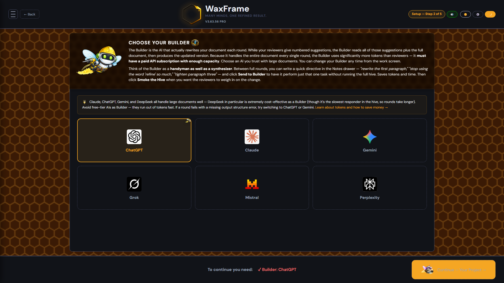
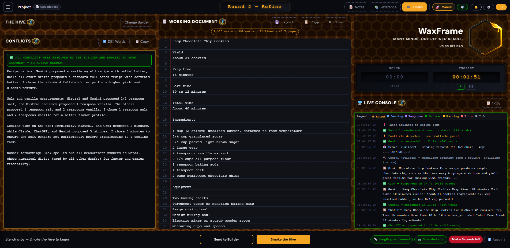
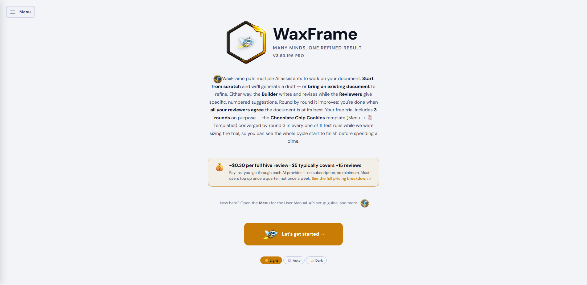
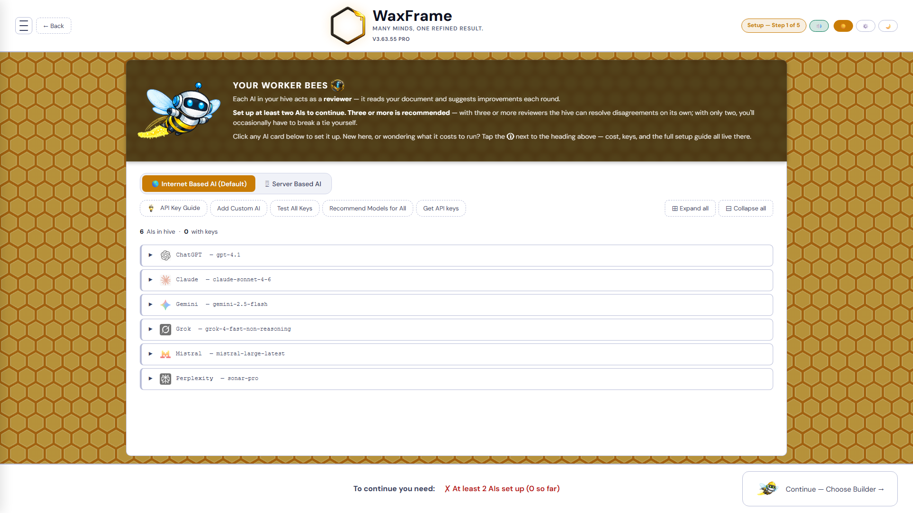
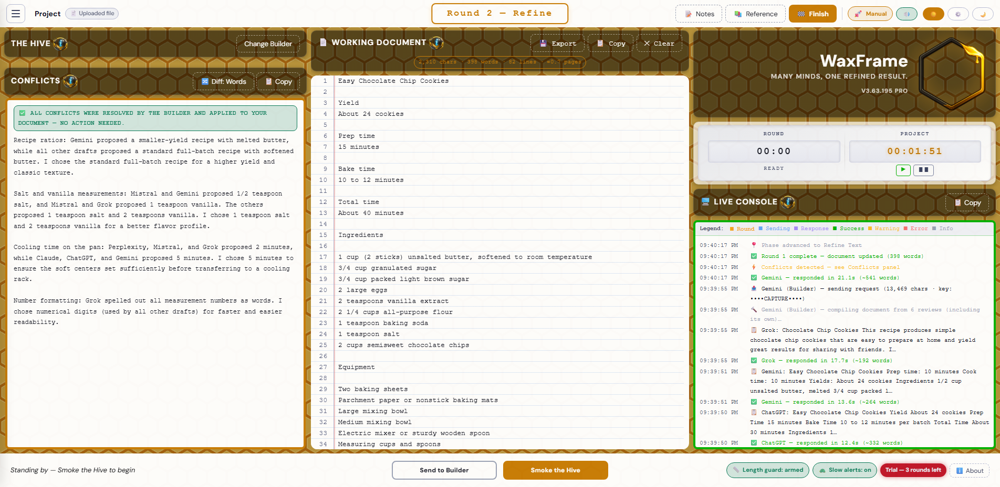

# WaxFrame

**Many minds. One refined result.**

WaxFrame orchestrates a team of AIs around your document — every round, all of them review, one of them builds, and the result gets better each time.

<a href="https://weirdave.github.io/WaxFrame-Professional/" target="_blank"><strong>→ Launch WaxFrame</strong></a>

---

## What is WaxFrame?

WaxFrame is a browser-based multi-AI document collaboration tool. You bring the AIs — WaxFrame coordinates them.

One AI acts as the **Builder**, rewriting your document each round based on numbered suggestions from your **Worker Bees**. The Builder reads every suggestion, resolves disagreements, flags conflicts for your review, and produces the updated document. Round by round, your document converges on something great.

No install. No server. No account. No data leaves your machine. Just open it and go.

---

## How It Works

**1. Set up your Hive**
Add API keys for the AIs you want to use and pick your Builder. You need at least 2 AIs to run a round. Start with just Gemini (free tier) and one paid AI if you want to keep costs low.

**2. Describe your project**
Give it a name, version, and a detailed goal. The more specific your goal, the better your results from round one.

**3. Start your document**
Upload an existing file (Word, PDF, PowerPoint, plain text, or Markdown), paste text directly, or let the hive generate a first draft from your goal. If you upload or paste, WaxFrame drops you straight into refinement — no draft phase needed.

**4. Smoke the Hive**
Hit **Smoke the Hive** to run a round. Every Worker Bee reads the document simultaneously and returns numbered suggestions. Your Builder reads all of them, applies the best ones, resolves disagreements, and rewrites the full document. The whole thing is automatic.

**5. Review conflicts**
When AIs disagree on something, the Builder flags it in the **Conflicts panel** rather than guessing. You pick the direction — or type your own — and the Builder applies your decision immediately.

**6. Iterate — you're always in charge**
Add notes before each round to steer the hive. Keep going as long as you want. There's no magic number of rounds. When *you* think the document is done, hit **Finish**. The hive works for you, not the other way around.

**7. Export**
Export your clean final document as a `.txt` file, complete with a project byline showing how many rounds it took and how long the session ran. You can also export a **Full Transcript** — a complete record of every round, every AI response, and every document version — from the History panel or the Finish screen.

> 💾 **Your session is saved automatically** using IndexedDB — no size limits, no data loss even on long multi-round sessions. If storage ever approaches its limit, WaxFrame will warn you and offer an immediate export.

---

## Two Modes

### 🆓 Free — Manual Workflow
No API keys needed. WaxFrame generates the prompts for you. Open each AI in its own tab, copy the prompt in, paste the response back. WaxFrame assembles the Builder prompt automatically and tells you what to do at every step. Works with any AI — free tiers included, no subscriptions required.

### ⚡ Pro — Fully Automated
One button does everything. Each AI needs its own API key. WaxFrame sends every prompt, collects every response, and runs the full round automatically — no copy/paste, no tab switching. **3 free rounds included** — try it before you buy. After that, a license key from [Gumroad](https://weirdave.gumroad.com/l/WaxFrame) unlocks unlimited rounds. **Gemini's API is currently free** — pair it with one paid AI and you're running full automated rounds for as little as $5 in credits.

---

## Setup — Configure Your Hive

Add API keys for each AI you want to use. Every AI with a saved key becomes a **Worker Bee** — reading the document and sending numbered suggestions each round.

Then pick your **Builder** — the AI that rewrites the document every round. The Builder does the heavy lifting: it reads the full document plus every suggestion and produces the updated version. Your Builder needs a paid API subscription with enough token capacity for your document size. You can change your Builder any time from the work screen without losing anything.

You can also add any custom AI with an OpenAI-compatible API endpoint.

---

## Setup — Your Project

Give your project a name, version number, and a detailed goal. The goal tells every AI what the document is, what it's trying to achieve, and what direction to take. The first 300 characters are sent as active context every round — make them count.

Then choose how to start:

| Option | When to use it |
|---|---|
| **Upload a file** | You have an existing document — Word, PDF, PowerPoint, plain text, or Markdown |
| **Paste text** | You have content elsewhere and want to copy it in directly |
| **Start from Scratch** | You have a goal but no document yet — the hive builds the first draft |

> **Heads up on PDFs:** PDF extraction works best with standard digitally-created documents. Heavily designed files, scanned documents, or image-based PDFs may extract poorly. If the text looks garbled, use the **Project** button in the topbar to go back and try Paste Text instead.

> **To launch you need:** a project name, a version number, a project goal, and a document source. The Launch button won't proceed until all four are in place.

---

## The Work Screen

Three panels keep everything in view:

**The Hive** — your active Worker Bees, each showing real-time status as the round runs. Toggle individual AIs on or off between rounds without losing their keys. Change your Builder at any time.

**Working Document** — your live document with line numbers. Edit directly at any time between rounds. AIs reference line numbers in their suggestions, which is how the hive stays coordinated across multiple models.

**Conflicts** — anything the Builder couldn't resolve on its own is flagged here. User Decisions need your input. Builder Decisions show what the Builder chose — override if you disagree.

The **Live Console** on the right shows everything happening in real time: which AIs are sending, responding, succeeding, or failing, with timestamps and response previews.

---

## Conflicts

When AIs disagree, the Builder flags it rather than making an arbitrary call. There are two kinds:

**User Decision** — the Builder found competing suggestions and needs you to choose. Pick one of the AI-generated options, type your own, bypass if you've already edited the document directly, or decline. Your decision is applied to the document immediately and locked — the AIs won't re-raise it.

**Builder Decision** — the Builder made a judgment call on your behalf. Review what it chose. If you disagree, select a different option or type your own and hit Apply.

**Bypass** — if you've already fixed something directly in the working document, choose "I edited the document directly — skip this conflict" to lock it without triggering another Builder pass. If all conflicts are bypassed, the round advances immediately.

> 💡 Click the "Current:" text on any conflict card to scroll the working document directly to that line and highlight it.

---

## Clocks

Two clocks sit above the Live Console:

**Round clock** — tracks how long the current round is taking, from the moment you hit Smoke the Hive through to round complete. Resets at the start of each new round. Green when running.

**Project clock** — tracks total time spent on the project. Starts when you smoke the hive for the first time, persists across refreshes, and pauses when you hit Finish. Amber when running, flashing amber when paused with time on it. Use the pause button any time you step away so your project time stays accurate.

---

## Supported AIs

| AI | Provider | Notes |
|---|---|---|
| ChatGPT | OpenAI | `gpt-4.1` — excellent at high-volume document work |
| Claude | Anthropic | `claude-sonnet-4-6` — large context, precise instruction following |
| Gemini | Google | `gemini-2.5-flash` — **free API tier available**, great starting point |
| DeepSeek | DeepSeek | `deepseek-chat` — very low cost per token, strong Builder |
| Grok | xAI | `grok-4` — good context window |
| Perplexity | Perplexity | `sonar-pro` — search-aware, works well as a reviewer |
| Copilot | Microsoft | `gpt-4o` — OpenAI-compatible endpoint |
| Custom | Any | Add any AI with an OpenAI-compatible API endpoint |

Any AI can act as either a Worker Bee or Builder. Mix and match however you like. If a round fails with a missing output structure error, try switching to a different Builder — some AIs are less consistent at following strict formatting instructions on large or complex documents.

---

## Getting Started

WaxFrame runs entirely in your browser — no install, no server, no account required.

> ⚠️ **Desktop only.** WaxFrame is designed for desktop and laptop computers. Mobile phones are not currently supported.

**Option 1 — Hosted version (easiest):**
👉 [weirdave.github.io/WaxFrame-Professional](https://weirdave.github.io/WaxFrame-Professional/)

**Option 2 — Run locally:**
1. Download or clone this repo
2. Open `index.html` in your browser
3. That's it — no build step, no dependencies

---

## User Guide

For detailed usage instructions — writing effective goals, handling conflicts, course correcting mid-session, and knowing when you're done — see the **[Working with the Hive](https://weirdave.github.io/WaxFrame-Professional/working-with-the-hive.html)** guide.

---

## API Keys

Each AI in Pro mode needs its own key from that provider. Keys are stored in your browser's `localStorage` and never leave your machine.

| Provider | Key Console |
|---|---|
| OpenAI (ChatGPT) | [platform.openai.com/api-keys](https://platform.openai.com/api-keys) |
| Anthropic (Claude) | [console.anthropic.com/settings/keys](https://console.anthropic.com/settings/keys) |
| Google (Gemini) | [aistudio.google.com/apikey](https://aistudio.google.com/apikey) |
| DeepSeek | [platform.deepseek.com/api_keys](https://platform.deepseek.com/api_keys) |
| xAI (Grok) | [console.x.ai](https://console.x.ai) |
| Perplexity | [perplexity.ai/settings/api](https://www.perplexity.ai/settings/api) |

For step-by-step instructions and direct billing links, open the **API Key Guide** inside the app.

---

## What Are Tokens?

If you're using Pro mode, tokens matter — especially for your Builder. Every round, your Builder reads the entire document plus all Worker Bee suggestions and rewrites the full document. On a 2,000-word document with 5 Worker Bees that's roughly **8,000–12,000 tokens per Builder call**.

**Gemini's free tier is genuinely generous** and a great way to get started with zero cost. For paid options, DeepSeek is the most cost-effective Builder by a wide margin.

If a round fails with a missing output structure error — especially on a large or complex document — try switching your Builder to ChatGPT or Gemini and retrying. Some AIs are less consistent at following strict formatting instructions under heavy load. This is a behavioral difference between models, not a hard size limit.

Open the **Token Guide** inside the app for a full cost breakdown by provider.

---

## Also looks great in Light Mode

| Welcome | Setup | Work |
|---|---|---|
|  |  |  |

---

## Privacy

- **No server.** No backend. No tracking. No analytics.
- **Your documents stay on your machine.** Nothing is ever sent anywhere except directly to the AI providers you choose.
- **Your API keys stay in your browser.** They are stored in `localStorage` and go directly to each provider — WaxFrame never sees them.
- **Fully open source.** Read every line at [github.com/WeirDave/WaxFrame-Professional](https://github.com/WeirDave/WaxFrame-Professional).

---

## License

WaxFrame is open source under the **AGPL-3.0** license. See [LICENSE](LICENSE) for full terms.

---

## Changelog

See [CHANGELOG.md](CHANGELOG.md) for the full version history.

---

Built by **WeirDave** · [github.com/WeirDave](https://github.com/WeirDave)

*With a lot of help from the hive.* 🐝

