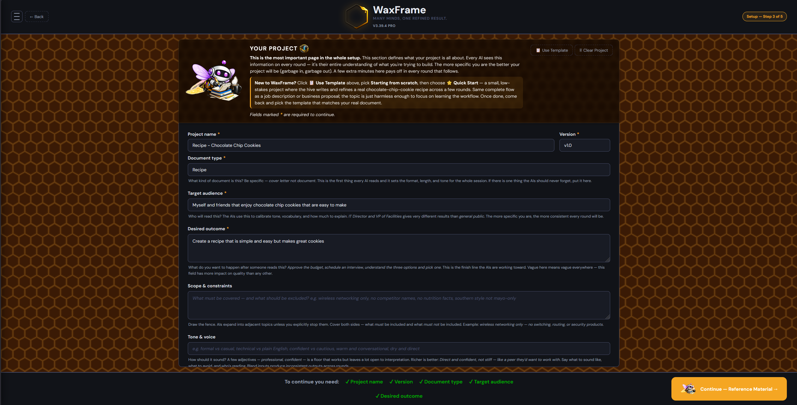
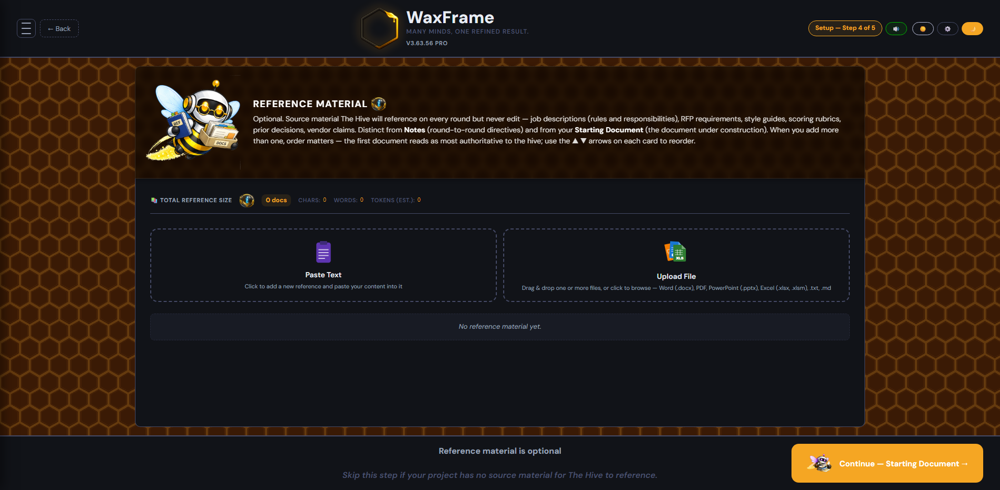
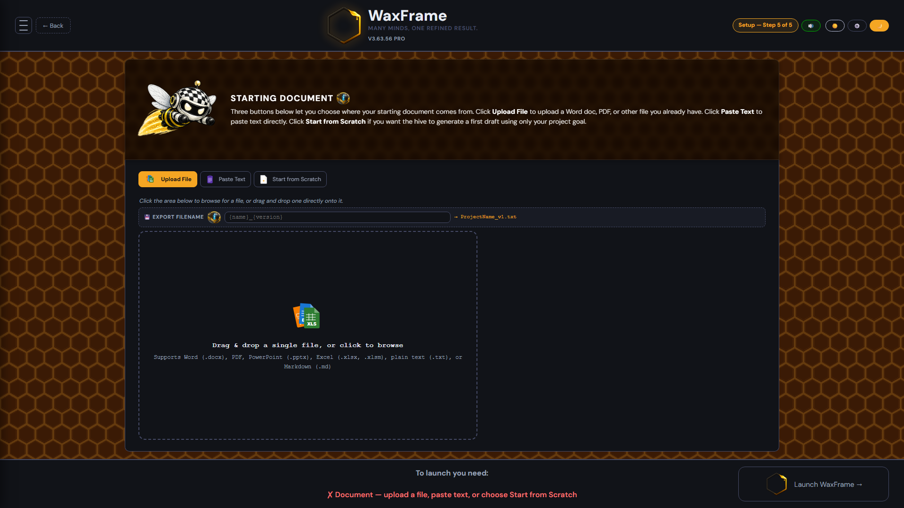
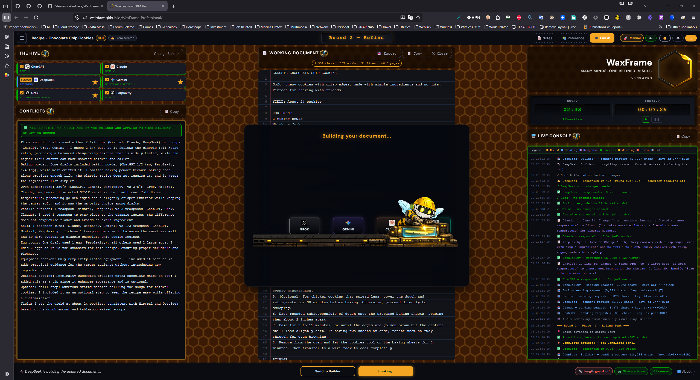
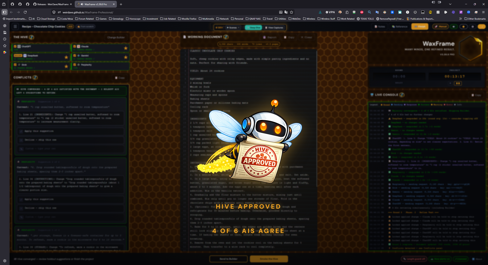

# WaxFrame Professional

**Many minds. One refined result.**

Multi-AI document refinement in your browser. No server, no account, no install.

### [→ Launch WaxFrame in your browser](https://weirdave.github.io/WaxFrame-Professional/)

  

---

## Table of Contents

- [What WaxFrame Does](#what-waxframe-does)
- [Why Multi-AI Beats Single-Shot](#why-multi-ai-beats-single-shot)
- [How It Works](#how-it-works)
- [Quick Start](#quick-start)
- [Free vs Pro](#free-vs-pro)
- [Supported AI Providers](#supported-ai-providers)
- [Privacy & Local-First Design](#privacy--local-first-design)
- [Run Locally](#run-locally)
- [License](#license)

---

## What WaxFrame Does

WaxFrame puts multiple AI assistants to work on your document at the same time. One AI acts as the **Builder** — writing and refining each round. The rest act as **Reviewers** — reading independently and producing numbered, specific suggestions. The Builder synthesizes those suggestions, surfaces any disagreements as conflict cards you resolve, and rewrites the document. Round by round, the document converges.

Whether you're starting from scratch, refining an existing draft, or generating source text for a presentation, the hive handles it. Your API keys stay in your browser. Your documents stay on your machine.

---

## Why Multi-AI Beats Single-Shot

Most AI writing workflows are one-shot: ask one model, get one answer, manually rewrite, repeat. That works for trivia and quick drafts. It breaks down on anything longer or higher-stakes — inconsistent tone, hallucinated details, weak structure, repetitive phrasing, and no second opinion when the first one is wrong.

WaxFrame replaces that loop with a structured editorial workflow:

- **Multiple independent reviewers.** Each AI reads the document in parallel without seeing the others' output. The perspectives stay genuinely independent.
- **One Builder.** A single AI is responsible for merging suggestions into a new version each round. You pick which AI does that job, and you can swap it any time.
- **Conflicts surfaced, not silently averaged.** When reviewers disagree, the Builder flags it and you decide.
- **Iterative convergence.** Rounds continue until reviewers stop proposing changes — typically 5–20 rounds, depending on starting quality and document complexity.
- **Human oversight at every stage.** You read the result, resolve conflicts, optionally add per-round Notes, and call the finish line.

The result is something closer to editorial review than to autocomplete.

---

## How It Works

A WaxFrame session has two AI roles and one document, processed in rounds. Every round is the same loop: reviewers read, Builder rewrites, you decide what to keep.

### 1. Build your hive

  

Each AI with a saved API key becomes a reviewer. You need at least two distinct model families to proceed — a hive of six AIs that are all near-identical fine-tunes of the same family is functionally one reviewer with six voices. Three or more reviewers is recommended so the hive can break ties without your input.

AIs without a saved key remain visible in the hive and skip automatically each round. Toggle individual AIs on or off for a session from the **Edit Hive** button on the work screen without losing their saved keys.

### 2. Choose your Builder

  

The Builder rewrites the entire document every round and uses significantly more tokens than any reviewer. It needs a paid API plan with real capacity — free-tier accounts run out mid-round. Claude, ChatGPT, Gemini, and DeepSeek all handle large documents reliably; DeepSeek is the most cost-effective by a wide margin, though it is the slowest responder in the hive, so expect longer rounds.

> **Gemini paid-tier caveat.** Gemini is free *only* while your Google AI Studio account has billing disabled. If you've added a credit card to AI Studio, Gemini requests can route through paid-tier paths and charge per token — and the Builder role is the cost amplifier (it reads everything every round). For casual use, keep AI Studio billing off. If billing is on, consider keeping Gemini as a Reviewer and using DeepSeek as Builder (the cheapest Builder option, though slower per round).

The Builder also acts as your handyman. Write a directive in the **Notes drawer** — *"rewrite the first paragraph,"* *"stop saying 'refine' so much,"* *"tighten paragraph three"* — and click **Send to Builder** to run just that one task without firing the full hive. Then **Smoke the Hive** when you want the reviewers to weigh in on the change. Pairing targeted Builder calls with full reviewer rounds is one of WaxFrame's most useful workflows.

### 3. Define your project

  

The Project screen is the most important page in setup. Every reviewer and the Builder read these six fields on every round — it's their entire understanding of what you're trying to build.

| Field | What it controls |
|---|---|
| Document type | Format, length conventions, depth — *cover letter* not *document* |
| Target audience | Tone, vocabulary, how much to explain |
| Desired outcome | The finish line — *approve the budget*, *schedule an interview* |
| Scope & constraints | What must and must not be included |
| Tone & voice | Style consistency across rounds and different AIs |
| Additional instructions | Hard rules that must survive every round |

Built-in templates cover cover letters, résumés, RFP responses, executive summaries, blog posts, business proposals, recipes, reviews, and more.

### 4. Add Reference Material (optional)

  

Reference Material is source content the hive **consults but never edits** — distinct from the Notes drawer and from your Starting Document. Use it for source recipes, RFP requirements, interview transcripts, style guides, scoring rubrics, prior consensus decisions, or competitor material you want to outflank.

It's the lever behind the biggest convergence-speed gains we've measured. A blog post that took 16 rounds when refined as a Starting Document converged in 4 rounds when the source thesis went into Reference Material instead, with an empty Starting Document — the hive built fresh from the scaffold rather than fighting an existing draft.

### 5. Provide your starting document

  

Three modes:

- **Upload File** — Word (.docx), PDF, PowerPoint (.pptx), Excel (.xlsx, .xlsm), Markdown (.md), or plain text (.txt). PDF extraction includes a re-extract-with-AI-vision fallback for scanned or heavily designed PDFs.
- **Paste Text** — drop content directly into the editor.
- **Start from Scratch** — the hive generates a first draft using only your Project Goal.

### 6. Smoke the hive

  

Every reviewer reads the document simultaneously and returns structured suggestions. The Builder evaluates them, merges what makes sense, rewrites the document in full, and produces the next version. The Live Console streams what's happening — which AI is sending, responding, succeeding, or failing — with timestamps and response previews.

### 7. Resolve conflicts

  

When reviewers disagree, WaxFrame surfaces a conflict card instead of silently averaging. You pick one of the options, type your own resolution, bypass if you've already fixed it directly inline, or decline to suppress the conflict entirely. Decisions are applied immediately and locked.

The conflicts panel always shows the current round only — it isn't a project-wide completion indicator. The document is "done" when the hive reaches convergence: a majority of reviewers stop proposing changes.

### 8. Iterate until convergence

  

Keep running rounds with **Smoke the Hive** until reviewer disagreement drops and the document stabilizes. There's no forced endpoint — you decide when it's done.

Export options include the final document on its own or a complete transcript covering every round, every AI response, every Builder rewrite, every conflict, every timestamp, and the full session history.

---

## Quick Start

If you've never run WaxFrame before, start here:

1. Open [the live app](https://weirdave.github.io/WaxFrame-Professional/).
2. On the Project screen, click **📋 Use Template** → **Starting from scratch** → **⭐ Quick Start**.
3. Walk through the rest of the setup with the defaults and launch.

The Quick Start template runs the entire workflow against a chocolate-chip-cookie recipe — same complete flow as a job description or business proposal, just with a topic harmless enough to focus on learning the interface. Typical convergence is two to four rounds, a few minutes, and very low API cost. Once you've seen the loop end-to-end, come back and pick the template that matches your real document.

---

## Free vs Pro

|   | Free | Pro |
|---|:---:|:---:|
| Multi-AI review workflow | ✓ | ✓ |
| Conflict resolution | ✓ | ✓ |
| Round history & transcripts | ✓ | ✓ |
| Document templates | ✓ | ✓ |
| Reference Material support | ✓ | ✓ |
| **Workflow** | Manual copy-paste | Fully automated |
| **API keys required** | No | Yes (yours) |
| **Round count** | Unlimited | 3 free trial rounds, then license |
| **Price** | Free | One-time license |

**Free** ([weirdave.github.io/WaxFrame-Free](https://weirdave.github.io/WaxFrame-Free/)) generates prompts you copy into ChatGPT, Claude, Gemini, DeepSeek, Grok, Perplexity, or any other AI service, then paste responses back. No API keys needed. Works with anything.

**Pro** ([weirdave.github.io/WaxFrame-Professional](https://weirdave.github.io/WaxFrame-Professional/)) automates the entire round — WaxFrame sends prompts, collects responses, builds Builder prompts, rewrites the document, tracks conflicts, and advances the workflow. You provide your own API keys (billing goes directly to the providers, not to WaxFrame). Three free rounds are included to try it; after that, a one-time license key from [Gumroad](https://weirdave.gumroad.com/l/WaxFrame) unlocks unlimited rounds.

---

## Supported AI Providers

WaxFrame ships with default configurations for these providers:

| Provider | Default Model |
|---|---|
| Anthropic (Claude) | `claude-sonnet-4-6` |
| OpenAI (ChatGPT) | `gpt-4.1` |
| Google (Gemini) | `gemini-2.5-flash` |
| xAI (Grok) | `grok-4-fast-non-reasoning` |
| Mistral | `mistral-large-latest` |
| Perplexity | `sonar-pro` |

You can change any AI's model at any time from the Worker Bees screen.

### Server / Self-Hosted Endpoints

WaxFrame also works with any OpenAI-compatible endpoint via **Add Custom AI** (single model) or **Import from Model Server** (bulk import every model from one gateway in one shot). Tested against:

| Endpoint | Type | Notes |
|---|---|---|
| **Ollama** | Local runtime | Run open-source models on your own machine. No API key needed. |
| **LM Studio** | Local runtime | Desktop GUI for serving local models. No API key needed. |
| **Open WebUI** | Self-hosted gateway | Aggregates multiple model backends behind one OpenAI-compatible API. |
| **Alfredo** | Enterprise gateway | Anduril's internal Open WebUI deployment — example of the enterprise gateway pattern WaxFrame supports out of the box. |
| **Together AI** | Hosted | OpenAI-compatible inference cloud. |
| **Mistral** | Hosted | First-party Mistral API. |
| **Cohere** | Hosted | First-party Cohere API. |

Anything else that speaks the OpenAI chat-completions shape will work too — point WaxFrame at the endpoint and it'll fetch the model list.

**Custom endpoints need CORS configured on the server side** — `Access-Control-Allow-Origin: *` or `https://weirdave.github.io` — since WaxFrame runs entirely in the browser and cannot bypass it. The six default providers above all have CORS pre-configured; you'll only need to set this on your own gateway.

---

## Privacy & Local-First Design

WaxFrame runs entirely in your browser. There is no WaxFrame server, no cloud sync, no account system, no telemetry, and no document collection. Your API keys are stored in your browser only and connect directly to whichever AI provider you select. Your session — hive configuration, project goal, reference material, round history, working document — persists in IndexedDB, on your machine.

That makes WaxFrame especially well-suited to business proposals, RFP responses, internal drafts, technical documentation, legal-adjacent workflows, and any material you'd rather not route through another SaaS platform.

Air-gapped and on-prem deployments are first-class. Self-hosted libraries ship in the repo, fonts are self-hosted (no Google Fonts CDN), and provider icons load locally — no external requests on round. Grab a [tagged release ZIP](#portable-work-servers-air-gapped-environments) and drop it on any internal server or workstation.

---

## Run Locally

WaxFrame is desktop-only. Minimum viewport is **1366 × 768 px**; **1600+ wide is recommended** for the multi-panel work screen.

### Hosted (easiest — just open the URL)

[weirdave.github.io/WaxFrame-Professional](https://weirdave.github.io/WaxFrame-Professional/)

Loads instantly. No download. Latest stable build.

### Portable (work, servers, air-gapped environments)

For corporate networks that block `github.io`, on-prem servers, internal-network laptops, secure rooms, or anywhere you'd rather not depend on an external CDN, grab a tagged release ZIP:

1. Open the [Releases page](https://github.com/WeirDave/WaxFrame-Professional/releases/latest)
2. Under **Assets**, download the **Source code (zip)**
3. Extract into any folder — desktop, USB stick, network share, internal web server
4. Open `index.html` in a browser

That's it. Every dependency ships in the ZIP — fonts, libraries (PDF.js, Mammoth, JSZip, SheetJS), provider icons, the whole stack. No CDN calls, no `npm install`, no build step. Once loaded, WaxFrame only talks to whichever AI endpoints you point it at. Drop it on an internal server and the whole team can hit it.

### From `main` (bleeding edge)

For the absolute latest dev work between tagged releases — accept that `main` may include in-flight features:

1. Click the green **Code** button at the top of this repo → **Download ZIP**
2. Extract and open `index.html`

No build step regardless of which path you pick. Vanilla HTML, CSS, and JavaScript.

---

## License

WaxFrame Professional is licensed under **AGPL-3.0** — open source, free to use and modify with attribution. See [LICENSE](LICENSE) for the full text.

---

Built by [WeirDave](https://www.weirdave.com) with [Claude](https://www.anthropic.com/claude).
Testing by Candy. Asset support by Kai.

The hive works for you. You make the final call.

